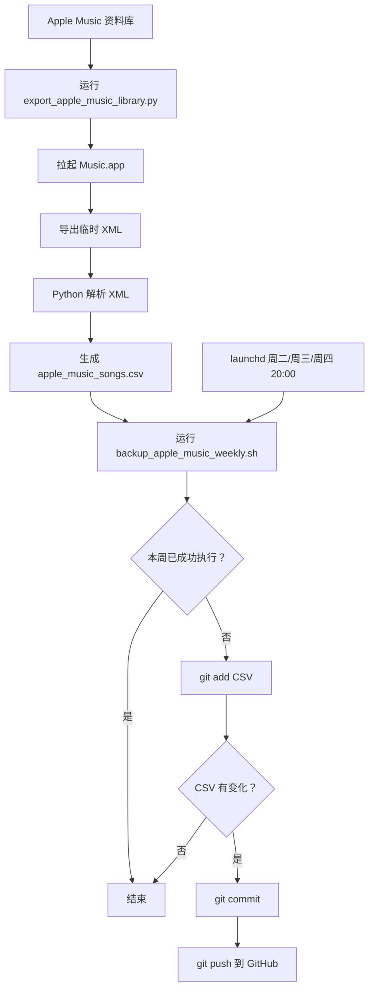

# Apple Music Backup

导出 Apple Music 资料库到 `CSV`，并用 `git` + `launchd` 做自动备份。

当前默认导出字段：

- 歌曲名
- 歌手
- 专辑
- 类别

## Quick Start

手动导出：

```bash
python3 export_apple_music_library.py
```

切换“类别”来源字段：

```bash
python3 export_apple_music_library.py --custom-field grouping
python3 export_apple_music_library.py --custom-field comments
python3 export_apple_music_library.py --custom-field work
```

初始化远程仓库：

```bash
./setup_apple_music_git_backup.sh <your-git-remote-url>
```

手动跑一次备份：

```bash
./backup_apple_music_weekly.sh
```

安装自动任务：

```bash
./install_apple_music_launch_agent.sh
```

## 自动备份策略

- 触发时间：周二、周三、周四 `20:00`
- 执行规则：同一周只成功执行一次
- 补位逻辑：周二没跑到，就等周三；周三也没跑到，就等周四
- 无变化时不会产生空提交

日志文件：

- `launchd-apple-music-backup.log`
- `launchd-apple-music-backup.error.log`

## 目录

- `export_apple_music_library.py`：导出 Apple Music 资料库
- `backup_apple_music_weekly.sh`：导出并自动 `git add / commit / push`
- `setup_apple_music_git_backup.sh`：初始化仓库并配置远程
- `install_apple_music_launch_agent.sh`：安装 `launchd` 定时任务
- `com.zzh.apple-music-weekly-backup.plist`：定时任务配置

## Flow


