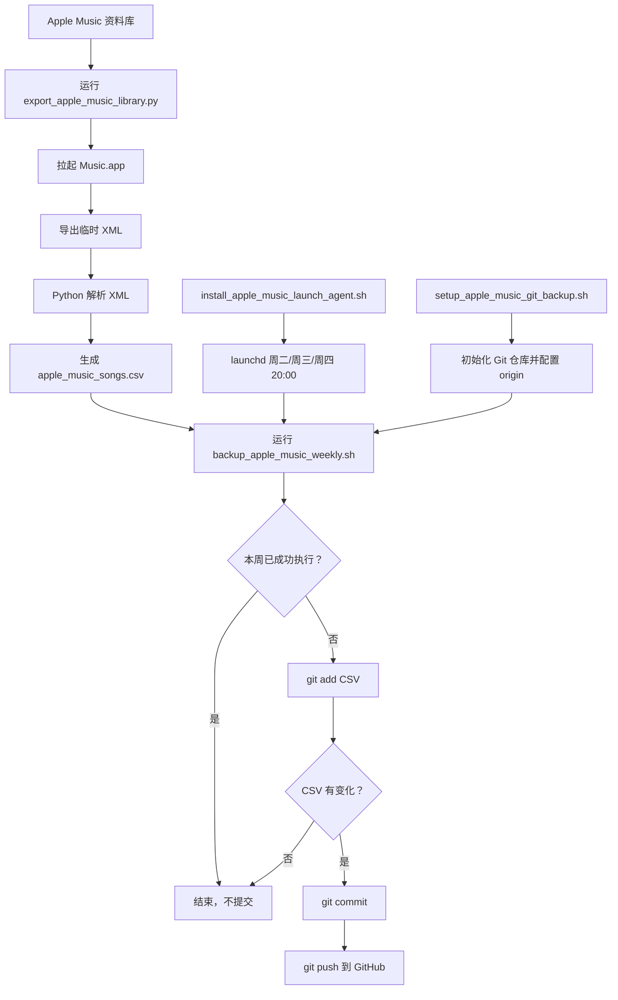

# Apple Music Backup

把本机 Apple Music 资料库中的歌曲信息导出为 `CSV`，并通过 `git` + `launchd` 做每周自动备份。

当前导出的核心字段：

- 歌曲名
- 歌手
- 专辑
- 自定义类别

默认情况下，“自定义类别”使用 Apple Music 的 `Genre` 字段；如果你的分类实际保存在 `Grouping`、`Comments`、`Work` 或 `Composer` 中，也可以切换。

## 文件说明

- `export_apple_music_library.py`
  从 Apple Music 导出资料库并生成 `apple_music_songs.csv`
- `backup_apple_music_weekly.sh`
  执行导出，并在 CSV 有变化时自动 `git add / commit / push`
- `setup_apple_music_git_backup.sh`
  初始化仓库并绑定远程仓库
- `install_apple_music_launch_agent.sh`
  安装每周自动运行的 `launchd` 任务
- `com.zzh.apple-music-weekly-backup.plist`
  每周定时任务配置

## 手动导出

在项目目录执行：

```bash
python3 export_apple_music_library.py
```

默认会生成：

```text
apple_music_songs.csv
```

如果你想把“类别”改为别的字段，可以这样运行：

```bash
python3 export_apple_music_library.py --custom-field grouping
python3 export_apple_music_library.py --custom-field comments
python3 export_apple_music_library.py --custom-field work
```

也可以自定义列名或输出路径：

```bash
python3 export_apple_music_library.py \
  --custom-field grouping \
  --custom-header 自定义类别 \
  --output ~/Desktop/apple_music_songs.csv
```

## 自动备份

### 1. 初始化 Git 远程仓库

```bash
./setup_apple_music_git_backup.sh <your-git-remote-url>
```

### 2. 先手动测试一次

```bash
./backup_apple_music_weekly.sh
```

这一步会：

1. 调用 `export_apple_music_library.py`
2. 生成或更新 `apple_music_songs.csv`
3. 检查 CSV 是否发生变化
4. 如果有变化，就自动提交并推送到远程仓库

### 3. 安装每周定时任务

```bash
./install_apple_music_launch_agent.sh
```

默认计划时间是：

- 周二、周三、周四
- 晚上 `20:00`

为了实现“这周只备份一次，但周二没开机就顺延到周三、周四”，备份脚本会记录本周是否已经成功执行过：

- 如果周二 `20:00` 成功跑了，本周后面的触发会自动跳过
- 如果周二没开机，周三 `20:00` 会接手
- 如果周三也没开机，周四 `20:00` 会再尝试一次
- 如果本周 CSV 没变化，也会记录为“本周已检查”，避免重复运行

日志文件位于项目目录：

- `launchd-apple-music-backup.log`
- `launchd-apple-music-backup.error.log`

## 为什么需要打开 Music.app

脚本不是直接去解析 Apple Music 的私有资料库文件，而是通过 macOS 的自动化接口，让 `Music.app` 自己导出一份临时 XML，再由 Python 解析这份 XML。

这样做的好处是：

- 兼容性更稳
- 不依赖私有数据库格式
- 更不容易被系统更新破坏

第一次运行时，macOS 可能会弹出自动化或媒体资料库权限提示，允许即可。

## 流程图



## 备注

- 这个方案依赖本机的 `Music.app`，因此更适合在自己的 Mac 上长期运行。
- 如果 CSV 没变化，自动备份脚本不会产生空提交。
- 当前策略是“周二优先，周三/周四补位，同一周只成功执行一次”。
- 如果你修改了备份时间，可以编辑 `com.zzh.apple-music-weekly-backup.plist` 后重新执行 `./install_apple_music_launch_agent.sh`。
